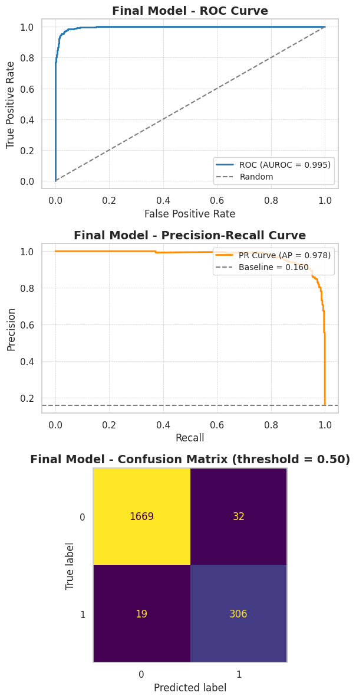
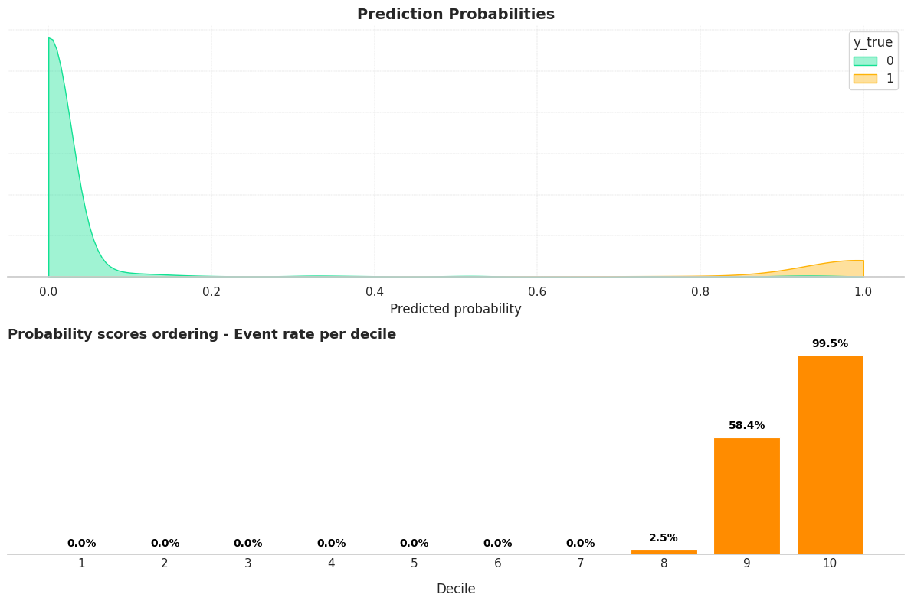
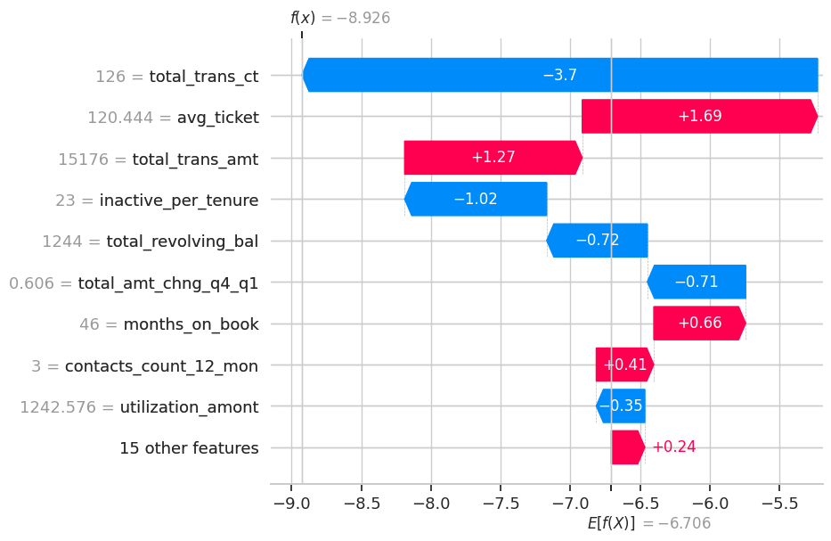
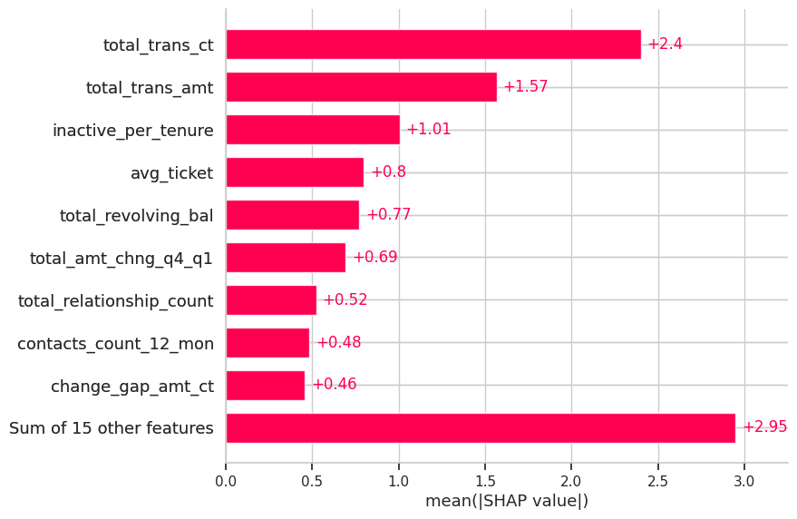
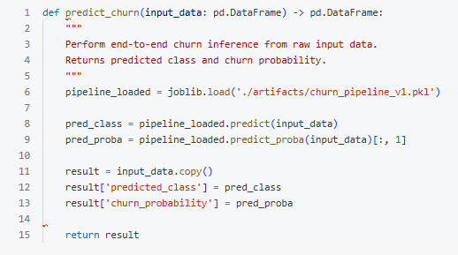
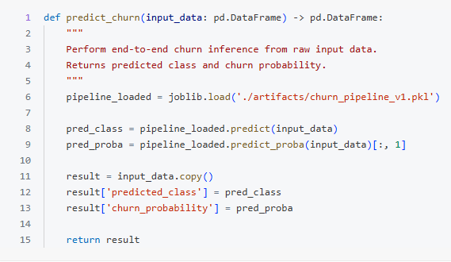

<a id="readme-top"></a>


[![Contributors][contributors-shield]][contributors-url]
[![Forks][forks-shield]][forks-url]
[![Stargazers][stars-shield]][stars-url]
[![Issues][issues-shield]][issues-url]
[![MIT License][license-shield]][license-url]
[![LinkedIn][linkedin-shield]][linkedin-url]

<br/>
<div align="center">
    
  
  <h1 align="center"> Churn Prediction </h1>

  <p align="center">
    <h3>Customer churn classification of a credit card service with LGBM - Classifier as the main classification model.</h3>
    <br/>
    <a href="https://github.com/OtnielGomes/Churn-Prediction-Credit-Card/tree/main/src"><strong>Explore the Docs and Functions »</strong></a>
    <br/><br/>
    <a href="https://github.com/OtnielGomes/Churn-Prediction-Credit-Card/tree/main/notebooks">View Notebooks</a>
    ·
    <a href="https://github.com/OtnielGomes/Churn-Prediction-Credit-Card/issues/new?labels=bug&template=bug-report---.md">Report Bug</a>
    ·
    <a href="https://github.com/OtnielGomes/Churn-Prediction-Credit-Card/issues/new?labels=enhancement&template=feature-request---.md">Request Feature</a>
  </p>
</div>


<!-- TABLE OF CONTENTS -->
<details>
  <br>
  <summary>Table of Contents</summary>
  <br/>
  <ol>
    <li>
      <a href="#about-the-project">About The Project</a>
      <ul>
        <li><a href="#built-with">Built With</a></li>
      </ul>
    </li>
    <li>
      <a href="#getting-started">Getting Started</a>
      <ul>
        <li><a href="#pre-requisites">Pre-requisites</a></li>
        <li><a href="#installation-of-libraries">Installation of libraries</a></li>
      </ul>
    </li>
    <li>
      <a href="#the-project">The Project</a></li>
      <ul>
        <li><a href="#1---business-understanding">1 - Business Understanding</a></li>
        <li><a href="#2---data-understanding">2 - Data Understanding</a></li>
        <li><a href="#3---data-preparation">3 - Data Preparation</a></li>
        <li><a href="#4---modeling">4 - Modeling</a></li>
        <li><a href="#5---evaluation">5 - Evaluation</a></li>
        <li><a href="#6---deployment">6 - Deployment</a></li>
      </ul>
    <li><a href="#roadmap">Roadmap</a></li>
    <li><a href="#contributing">Contributing</a></li>
    <li><a href="#license">License</a></li>
    <li><a href="#contact">Contact</a></li>
  </ol>
</details>

<br/>

<!-- ABOUT THE PROJECT -->
## About The Project

<br/>

## Project Description 
In this project, I will be working with a dataset provided by **Kaggle**, where I will develop a churn-rate analysis. The goal is to identify the causes and reasons for customer churn from a banking institution in relation to credit card services. After understanding these causes and reasons, some machine learning models will be developed to predict potential customers who will be abandoning the credit card service of this institution. With these predictions, I will seek to develop solutions to prevent or reverse the churn of these customers.  

---

### CRISP-DM Methodology
This project follows the CRISP-DM (*Cross-Industry Standard Process for Data Mining*) framework applied to **Customer Retention & Churn Prediction**:
| **Stage** | **Objective** | **Methodological Execution** |
| :--- | :--- | :--- |
| **1. Business Understanding** | Mitigate revenue loss by identifying at-risk customers. | • **Target Definition**: Binary Classification (Churn: Yes/No).<br>• **KPIs**: Maximize **Lift** in retention campaigns & Revenue Saved vs. Cost. |
| **2. Data Understanding** | Detect patterns of friction and dissatisfaction. | • **EDA**: Distribution analysis (Detect Imbalance).<br>• **Hypothesis Testing**: Correlation Matrix & Independence Tests (Chi-Square). |
| **3. Data Preparation** | Construct a robust dataset for parametric modeling. | • **Scaling**: Standardization (Z-score) for coefficient comparability.<br>• **Encoding**: One-Hot Encoding for nominal variables.<br>• **Splitting**: Stratified Train/Test Split to preserve class ratio. |
| **4. Modeling** | Estimate Churn Probability | • **Algorithms**: Logistic Regression, SVM LinearSVC, KNN, Random Florest, XGBoost, LightGBM.<br>• **Inference**: Analyze **Odds Ratios** to determine feature elasticity. |
| **5. Evaluation** | Assess model reliability and financial impact. | • **Discrimination**: AUC-ROC & F1-Score & Recall.<br>• **Calibration**: Probability Calibration Curve (Reliability Diagram). |
| **6. Deployment** | Integrate insights into the CRM lifecycle. | • **Deliverable**: "High-Risk" Customer List for Marketing Squad.<br>• **Artifact**: Serialize model (`joblib`) for batch inference. |

---

<p align="right">(<a href="#readme-top">back to top</a>)</p>


<br/>

## Built With
<br/>

- [![Databricks][Databricks Free]][Databricks Free-url]
- [![Language Python][Python]][Python-url]
- [![Apache][Apache Spark]][Apache Spark-url]
- [![PD][Pandas]][Pandas-url]
- [![NP][NumPy]][NumPy-url]
- [![Matplot][Matplotlib]][Matplotlib-url]
- [![Scipy][Scipy]][Scipy-url]
- [![Sklearn][scikit-learn]][scikit-learn-url]


<p align="right">(<a href="#readme-top">back to top</a>)</p>


## Getting Started

<br/>

**Clone the repository**
```sh
git clone https://github.com/OtnielGomes/Churn-Prediction-Credit-Card
```
<br/>

### Pre-requisites

> 📌 **This entire project was built using Databricks Free Edition**.

---

### 🧠 What is Databricks Free Edition?

**Databricks Free Edition** is the free version of the Databricks platform, designed for **students, educators, developers, and data enthusiasts**.  
It replaces the former *Community Edition* and offers a **serverless** environment with limited resources — ideal for **prototyping, learning, and collaboration**.

With it, you can:
- Create interactive notebooks (Python, SQL, Scala, R)
- Use **Databricks Assistant** for code suggestions and corrections
- Train machine learning models and build data pipelines
- Collaborate in real time with other users

---

### 📝 How to Sign Up

#### 1. Go to:  
[Databricks Free Edition – Microsoft Learn](https://learn.microsoft.com/en-us/azure/databricks/getting-started/free-edition)  
#### 2. Sign in with Google, GitHub, Microsoft, or another supported provider.  
#### 3. A **free workspace** will be automatically created for you.

---

### 🧭 First Steps in the Workspace

### 1. **Workspace**
- Organize your notebooks, scripts, and datasets
- Create folders and set sharing permissions

### 2. **Notebook**
- Interactive interface for writing and running code
- Supports **Python, SQL, R, Scala**

### 3. **Databricks Assistant**
- AI-powered helper that explains, suggests, and fixes code
- Works in notebooks and SQL editor


### Installation of Libraries

The installation of the required libraries is performed using the command:

```python
%pip install '..\requirements.txt'
```

This command is present in the first notebook of this project.

---

💡 **Note**:  
- In Jupyter/Databricks notebooks, the `%pip` magic command installs packages directly into the current environment.  
- If your `requirements.txt` file is located in a subdirectory or at a different path, make sure to update the path accordingly (e.g., `../requirements.txt`).

<p align="right">(<a href="#readme-top">back to top</a>)</p>


<br/>

## The Project

<br/>

## 1 - Business Understanding  
---

### Project Challenge


The bank manager identified growth in the number of customers who are abandoning the credit card service.

Given this scenario, the main objective of the project will be to transform historical data into **actionable intelligence**, making it possible to understand the factors associated with churn and anticipate customer attrition risk.

Stakeholders expect the proposed solution to be capable of:

1. **Analyzing historical data** to identify patterns and variables related to churn.
2. **Developing a machine learning model** to estimate the probability of customer attrition.
3. **Supporting strategic retention actions**, prioritizing customers with the highest cancellation propensity.

> From a business perspective, the project aims to reduce customer losses, improve the efficiency of retention campaigns, and support data-driven decisions in the context of active customer relationship management.

---

<p align="right">(<a href="#readme-top">back to top</a>)</p>

<br/>

## 2 - Data Understanding

---

### Dataset Overview
This dataset contains information from 10,000 bank customers, including demographic, financial, and relationship-related attributes such as age, salary, marital status, credit card limit, and card category.

> These variables provide the analytical foundation for investigating behavioral patterns associated with customer attrition and for supporting the construction of predictive models.

---

### Data File
- **Data file**: `BankChurners.csv`

---

### Target Variable
The dependent target variable is **`Attrition_Flag`**, a categorical feature with binary classes:

1. **`Existing Customer`**
- Represents customers who remained active, that is, non-churners.

2. **`Attrited Customer`**
- Represents customers who discontinued their relationship with the credit card service, that is, churners.

> Since this is a **binary classification** problem, the target variable will be used to distinguish customers who remain in the base from those who are more likely to leave.

---

### Data Source
- **Dataset collected from Kaggle**:

[https://www.kaggle.com/datasets/sakshigoyal7/credit-card-customers?sort=votes&select=BankChurners.csv](https://www.kaggle.com/datasets/sakshigoyal7/credit-card-customers?sort=votes&select=BankChurners.csv)

- **Original dataset reference**:

[https://leaps.analyttica.com/home](https://leaps.analyttica.com/home)

---
## Exploratory Data Analysis (EDA):
---

> The EDA will be conducted in three main stages: univariate, bivariate, and multivariate analysis.

### Univariate analysis

> **Evaluates one variable at a time, focusing on distribution, central tendency, dispersion, and outlier detection.**

---
### Bivariate analysis

> **Investigates the relationship between two variables, allowing the analysis of correlation, association, or differences between groups.**
---
### Multivariate analysis

> **Examines three or more variables simultaneously in order to identify more complex patterns, interactions, and joint behavior.**
---
<br/>

## Univariate Analysis:
---

<br/><br/>
<div align="center">
    
  </a>
</div>
<br/>

---

<br/><br/>
<div align="center">
    
  </a>
</div>
<br/>

<p align="right">(<a href="#readme-top">back to top</a>)</p>

<br/>

---

<br/><br/>
<div align="center">
    
  </a>
</div>
<br/>

---

<br/><br/>
<div align="center">
    
  </a>
</div>
<br/>

## Bi-Variate Analysis:
---
### Correlation of Variables x Churn

<br/><br/>
<div align="center">
    
  </a>
</div>
<br/>

<p align="right">(<a href="#readme-top">back to top</a>)</p>

<br/>

---
<br/><br/>
<div align="center">
    
  </a>
</div>
<br/>

---
<br/><br/>
<div align="center">
    
  </a>
</div>
<br/>

---
### Statistical Tests

---
<br/><br/>
<div align="center">
    
  </a>
</div>
<br/>

---
<br/><br/>
<div align="center">
    
  </a>
</div>
<br/>

### Multi-Variate Analysis:
---
<br/><br/>
<div align="center">
    
  </a>
</div>
<br/>


<p align="right">(<a href="#readme-top">back to top</a>)</p>

<br/>


## 3 - Data Preparation
---

- For the data preparation stage, **two distinct pipelines** were developed: one designed for **linear models** and the other for **tree-based models**.


> This separation was adopted because each family of algorithms has its own preprocessing requirements, especially with regard to **scaling numerical variables** and **encoding categorical variables**.


- As discussed in the EDA, the initial decision was to remove only the variables **`equip`** and **`wireless`**, since they showed high correlation with **`equipmon`** and **`wiremon`**, respectively.


- The other highly correlated variables were deliberately retained at this initial stage.


> This decision allows the modeling process to empirically evaluate how different algorithms handle **multicollinearity**, **informational redundancy**, and the possible **marginal predictive gain** associated with these variables.


- In both pipelines, the data preparation flow followed the same general structure:


- **Variable type optimization**, with the objective of ensuring structural consistency, reducing memory usage, and adapting the data to the computational requirements of the algorithms.

- **Feature engineering**, with the creation of new derived variables based on findings from the exploratory analysis and domain knowledge.

- **Model-family-specific preprocessing**, respecting the technical particularities of each modeling approach and ensuring compatibility between the transformed data and the algorithms used.

---


<p align="right">(<a href="#readme-top">back to top</a>)</p>

<br/>

## 4 - Modeling
---

### Model Evaluation and Selection Strategy
---

- The primary metric defined for this project will be **AUC-ROC**.


> Since the problem involves **imbalanced classes** and the central objective is to develop a model capable of estimating the **probability of churn**, AUC-ROC is appropriate because it provides a comprehensive view of the model's discriminative ability between the two classes.


- As secondary metrics, **F1-score** and **recall for the churn class** will also be monitored.


> The **F1-score** will be used to evaluate the balance between **precision** and **recall**, while **recall for the churn class** will receive special attention, since correctly identifying customers at higher risk of churn is essential for guiding retention actions.


> This choice is strategically relevant, since **retaining a customer** through engagement and loyalty campaigns is approximately **five times less costly** than **acquiring a new customer**.

- Initial training will be conducted using **cross-validation**, with the objective of increasing the robustness of model evaluation at this stage of the project.


> **5 folds** will be used, and the selection of the best model will consider not only the **highest mean AUC-ROC**, but also the **lowest variability** among the results observed across the different folds, seeking consistent performance and greater generalization capability.

- Simpler models, such as **Logistic Regression** and **Decision Tree Classifier**, will be tested.

- And more robust models, such as **Linear SVC** and **LightGBM**, will also be evaluated.

> The objective of this comparison is to verify whether the structure of the data benefits from algorithms with **greater modeling capacity**, making it possible to assess potential performance gains in relation to simpler approaches.

---
<br/>
<div align="center">
    
  </a>
</div>
<br/>


<p align="right">(<a href="#readme-top">back to top</a>)</p>

---

<br/>

## 5 - Evaluation

---
<br/>
<div align="center">
    
  </a>
</div>
<br/>

---
<br/>
<div align="center">
    
  </a>
</div>
<br/>

## SHAP - Analysis
---
<br/>
<div align="center">
    
  </a>
</div>
<br/>

---
<br/>
<div align="center">
    
  </a>
</div>
<br/>

---
<br/>
<div align="center">
    
  </a>
</div>
<br/>

<p align="right">(<a href="#readme-top">back to top</a>)</p>

<br/>


## Business Financial Impact of the Model
---

> These metrics validate the robustness of the trained model and its suitability for deployment in retention strategies. The high **AUC-ROC** enables more assertive campaigns focused on customers classified as churners. Considering the **Customer Acquisition Cost (CAC)** and **Lifetime Value (LTV)**, it is possible to build a hypothetical scenario, since no official figures are available for this institution, in order to estimate the costs involved in retention and the potential customer loss.
---

##### Hypothetical cost scenario

- **Cost to acquire a customer:** US\$ 2,500
- **Cost to retain a customer classified as a churner:** US\$ 500

> Based on the confusion matrix:

- **325 churners**
- **1701 non-churners**
- The model classified **338 customers as churners**
---

##### 1. Cost of false positives

> **False positives** represent non-churners who were classified as churners.

- With a **precision of 90.53%**, there were **32 false positives**.
- Cost: **32 × US\$ 500 = US\$ 16,000**
- Total retention campaign cost: **338 × US\$ 500 = US\$ 169,000**
- Share of incorrectly allocated resources: **US\$ 16,000 / US\$ 169,000 = 9.46%**

> This result can be considered satisfactory, since only a small portion of resources would be allocated to customers who would not have left the service anyway. Even so, these actions may still generate a positive impact on customer loyalty.
---

##### 2. Preservation of acquisition investment (CAC)

- Total investment required to replace the **325 churners**: **325 × US\$ 2,500 = US\$ 812,500.00**
- With a **recall of 94.15%**, the model correctly identifies **306 churners**
- Preserved value: **306 × US\$ 2,500 = US\$ 765,000.00**

> Therefore, the model has the potential to preserve up to **US\$ 765,000.00** in acquisition investment, provided that retention actions are effective.

> The high **AUC-ROC** reinforces confidence in making more aggressive decisions with a low risk of wasting resources on customers who are not actually at risk of churn.
---

##### 3. Lifetime Value (LTV) assessment

> **Lifetime Value (LTV)** is a strategic metric that estimates the total value generated by a customer throughout their relationship with the institution.

> This metric helps assess whether investments in **acquisition (CAC)** and **retention** are financially justified.

> The simplified formula for calculating LTV is:

**LTV = Average Ticket × Purchase Frequency × Average Relationship Duration**

> For illustrative purposes, consider the following estimated values based on credit card customers:

- **Average monthly ticket:** US\$ 150 *(estimated value, since no official data is available)*
- **Purchase frequency:** monthly
- **Average relationship duration:** 3 years (36 months), based on the bank’s customer history

**Estimated LTV = 150 × 12 × 3 = US\$ 5,400**

> This value represents the average return the bank can expect from each customer over a three-year period.

> When compared with the **average CAC of US\$ 2,500**, this results in an **LTV/CAC ratio of 2.16**, indicating a healthy and sustainable relationship, since the value generated per customer is more than double the acquisition cost.
---

##### Potential revenue preserved

> This analysis reinforces the importance of effective retention strategies.

- By preserving churners, the model not only avoids losing the acquisition investment but also **protects these customers’ future LTV**.

- **Potential gross revenue** over a 3-year period for customers identified as churners and successfully retained:  
  **306 × US\$ 5,400 = US\$ 1,652,400.00**

- In addition, with a **recall of 94.15%**, the model has the potential to preserve up to **US\$ 765,000.00** in acquisition investment (**CAC**) and **US\$ 1.65 million** in future gross revenue (**LTV**), provided that retention actions are effective.
---

##### Conclusion

> A predictive model with high **AUC-ROC** and high **recall** not only reduces immediate losses but also **maximizes long-term customer value**, directly contributing to the institution’s profitability and sustainability.
---

## 6 - Deployment  
---

<br/>
<div align="center">
    
</div>

---

<br/>
<div align="center">
    
</div>


<p align="right">(<a href="#readme-top">back to top</a>)</p>

<!-- ROADMAP -->
<br/>

## Roadmap

- [Notebook-1-EDA](https://github.com/OtnielGomes/Churn-Prediction-Credit-Card/blob/main/notebooks/0_EDA.ipynb)
- [Notebook-2-Modeling](https://github.com/OtnielGomes/Churn-Prediction-Credit-Card/blob/main/notebooks/1_Modeling.ipynb)


See the [open issues](https://github.com/OtnielGomes/1_Portfolio-Credit-Card_Churn_Analysis_with_Pytorch/issues) for a full list of proposed features (and known issues).

<p align="right">(<a href="#readme-top">back to top</a>)</p>

<!-- CONTRIBUTING -->
<br/>

## Contributing

Contributions are what make the open source community such an amazing place to learn, inspire, and create. Any contributions you make are **greatly appreciated**.

If you have a suggestion that would make this better, please fork the repo and create a pull request. You can also simply open an issue with the tag "enhancement".

<p align="right">(<a href="#readme-top">back to top</a>)</p>

### Top contributors:

<br/>
<a href="https://github.com/OtnielGomes/Churn-Prediction-Credit-Card/graphs/contributors">
  
</a>


<!-- LICENSE -->
<br/>

## License

Distributed under the MIT License. See [`LICENSE.txt`](https://github.com/OtnielGomes/Churn-Prediction-Credit-Card/blob/main/LICENSE) for more information.

<p align="right">(<a href="#readme-top">back to top</a>)</p>


<!-- CONTACT -->

<br/>

## Contact

[![LinkedIn][linkedin-shield]][linkedin-url]

<p align="right">(<a href="#readme-top">back to top</a>)</p>


<!-- MARKDOWN LINKS & IMAGES -->

[contributors-shield]: https://img.shields.io/github/contributors/OtnielGomes/Churn-Prediction-Credit-Card.svg?style=for-the-badge
[contributors-url]: https://github.com/OtnielGomes/Churn-Prediction-Credit-Card/graphs/contributors

[forks-shield]: https://img.shields.io/github/forks/OtnielGomes/Churn-Prediction-Credit-Card.svg?style=for-the-badge
[forks-url]: https://github.com/OtnielGomes/Churn-Prediction-Credit-Card/network/members

[stars-shield]: https://img.shields.io/github/stars/OtnielGomes/Churn-Prediction-Credit-Card.svg?style=for-the-badge
[stars-url]: https://github.com/OtnielGomes/Churn-Prediction-Credit-Card/stargazers

[issues-shield]: https://img.shields.io/github/issues/OtnielGomes/Churn-Prediction-Credit-Card.svg?style=for-the-badge
[issues-url]: https://github.com/OtnielGomes/Churn-Prediction-Credit-Card/issues

[license-shield]: https://img.shields.io/github/license/OtnielGomes/Churn-Prediction-Credit-Card.svg?style=for-the-badge
[license-url]: https://github.com/OtnielGomes/Churn-Prediction-Credit-Card/blob/main/LICENSE

[linkedin-shield]: https://img.shields.io/badge/-LinkedIn-black.svg?style=for-the-badge&logo=linkedin&colorB=555
[linkedin-url]: https://linkedin.com/in/otnielgomes

[Azure Databricks]: https://img.shields.io/badge/Databricks-FF3621?style=for-the-badge&logo=Databricks&logoColor=white
[Azure Databricks-url]:  https://azure.microsoft.com/en-us/pricing/purchase-options/azure-account?icid=databricks


[scikit-learn]: https://img.shields.io/badge/scikit--learn-%23F7931E.svg?style=for-the-badge&logo=scikit-learn&logoColor=white
[scikit-learn-url]: https://scikit-learn.org/stable/

[Apache Spark]: https://img.shields.io/badge/Apache%20Spark-FDEE21?style=flat-square&logo=apachespark&logoColor=black
[Apache Spark-url]: https://spark.apache.org/

[Pandas]: https://img.shields.io/badge/pandas-%23150458.svg?style=for-the-badge&logo=pandas&logoColor=white
[Pandas-url]: https://pandas.pydata.org/

[Matplotlib]: https://img.shields.io/badge/Matplotlib-%23ffffff.svg?style=for-the-badge&logo=Matplotlib&logoColor=black
[Matplotlib-url]: https://matplotlib.org/

[Scipy]: https://img.shields.io/badge/SciPy-%230C55A5.svg?style=for-the-badge&logo=scipy&logoColor=%white
[Scipy-url]: https://scipy.org/

[NumPy]: https://img.shields.io/badge/numpy-%23013243.svg?style=for-the-badge&logo=numpy&logoColor=white
[NumPy-url]: https://numpy.org/

[Python]: https://img.shields.io/badge/python-3670A0?style=for-the-badge&logo=python&logoColor=ffdd54
[Python-url]: https://www.python.org/

[Databricks Free]: https://img.shields.io/badge/Databricks-FF3621?style=for-the-badge&logo=Databricks&logoColor=white
[Databricks Free-url]: https://www.databricks.com/br/learn/free-edition
