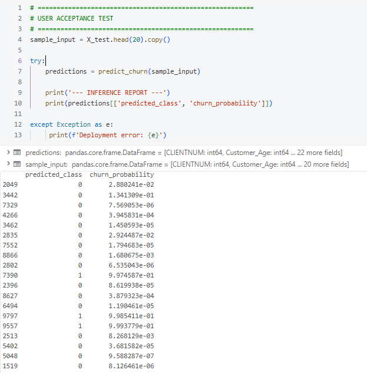

<a id="readme-top"></a>

# Churn Prediction

<p align="left">
  
  
  
  
  
  
  
  
  
</p>

---

<div align="center">
  <a href="https://github.com/OtnielGomes/Churn-Prediction-Credit-Card">
    
  </a>
</div>

---

<h3 align="center">Customer churn classification of a credit card service with LGBM-Classifier as the main classification model.</h3>

<p align="center">
  <a href="https://github.com/OtnielGomes/Churn-Prediction-Credit-Card/tree/main/src"><strong>Explore the Docs and Functions »</strong></a>
  <br/><br/>
  <a href="https://github.com/OtnielGomes/Churn-Prediction-Credit-Card/tree/main/notebooks">View Notebooks</a>
  ·
  <a href="https://github.com/OtnielGomes/Churn-Prediction-Credit-Card/issues/new?labels=bug&template=bug-report---.md">Report Bug</a>
  ·
  <a href="https://github.com/OtnielGomes/Churn-Prediction-Credit-Card/issues/new?labels=enhancement&template=feature-request---.md">Request Feature</a>
</p>

---

<!-- TABLE OF CONTENTS -->
<details>
  <br>
  <summary>Table of Contents</summary>
  <br/>
  <ol>
    <li>
      <a href="#about-the-project">About The Project</a>
      <ul>
        <li><a href="#built-with">Built With</a></li>
      </ul>
    </li>
    <li>
      <a href="#getting-started">Getting Started</a>
      <ul>
        <li><a href="#pre-requisites">Pre-requisites</a></li>
        <li><a href="#installation-of-libraries">Installation of Libraries</a></li>
      </ul>
    </li>
    <li>
      <a href="#the-project">The Project</a>
      <ul>
        <li><a href="#1---business-understanding">1 - Business Understanding</a></li>
        <li><a href="#2---data-understanding">2 - Data Understanding</a></li>
        <li><a href="#3---data-preparation">3 - Data Preparation</a></li>
        <li><a href="#4---modeling">4 - Modeling</a></li>
        <li><a href="#5---evaluation">5 - Evaluation</a></li>
        <li><a href="#6---deployment">6 - Deployment</a></li>
      </ul>
    </li>
    <li><a href="#roadmap">Roadmap</a></li>
    <li><a href="#contributing">Contributing</a></li>
    <li><a href="#license">License</a></li>
    <li><a href="#contact">Contact</a></li>
  </ol>
</details>

---

## About The Project

In this project, I will be working with a dataset provided by **Kaggle**, where I will develop a churn-rate analysis. The goal is to identify the causes and reasons for customer churn from a banking institution in relation to credit card services. After understanding these causes and reasons, some machine learning models will be developed to predict potential customers who will be abandoning the credit card service of this institution. With these predictions, I will seek to develop solutions to prevent or reverse the churn of these customers.

---

### CRISP-DM Methodology

This project follows the CRISP-DM (*Cross-Industry Standard Process for Data Mining*) framework applied to **Customer Retention & Churn Prediction**:

| **Stage** | **Objective** | **Methodological Execution** |
| :--- | :--- | :--- |
| **1. Business Understanding** | Mitigate revenue loss by identifying at-risk customers. | • **Target Definition**: Binary Classification (Churn: Yes/No).<br>• **KPIs**: Maximize **Lift** in retention campaigns & Revenue Saved vs. Cost. |
| **2. Data Understanding** | Detect patterns of friction and dissatisfaction. | • **EDA**: Distribution analysis (Detect Imbalance).<br>• **Hypothesis Testing**: Correlation Matrix & Independence Tests (Chi-Square). |
| **3. Data Preparation** | Construct a robust dataset for parametric modeling. | • **Scaling**: Standardization (Z-score) for coefficient comparability.<br>• **Encoding**: One-Hot Encoding for nominal variables.<br>• **Splitting**: Stratified Train/Test Split to preserve class ratio. |
| **4. Modeling** | Estimate Churn Probability. | • **Algorithms**: Logistic Regression, SVM LinearSVC, KNN, Random Forest, XGBoost, LightGBM.<br>• **Inference**: Analyze **Odds Ratios** to determine feature elasticity. |
| **5. Evaluation** | Assess model reliability and financial impact. | • **Discrimination**: AUC-ROC & F1-Score & Recall.<br>• **Calibration**: Probability Calibration Curve (Reliability Diagram). |
| **6. Deployment** | Integrate insights into the CRM lifecycle. | • **Deliverable**: "High-Risk" Customer List for Marketing Squad.<br>• **Artifact**: Serialize model (`joblib`) for batch inference. |

<p align="right">(<a href="#readme-top">back to top</a>)</p>

---

## Built With

<p align="left">
  
  
  
  
  
  
  
  
</p>

<p align="right">(<a href="#readme-top">back to top</a>)</p>

---

## Getting Started

**Clone the repository**

```bash
git clone https://github.com/OtnielGomes/Churn-Prediction-Credit-Card
```

### Pre-requisites

> 📌 **This entire project was built using Databricks Free Edition.**

---

### 🧠 What is Databricks Free Edition?

**Databricks Free Edition** is the free version of the Databricks platform, designed for **students, educators, developers, and data enthusiasts**.
It replaces the former *Community Edition* and offers a **serverless** environment with limited resources — ideal for **prototyping, learning, and collaboration**.

With it, you can:
- Create interactive notebooks (Python, SQL, Scala, R)
- Use **Databricks Assistant** for code suggestions and corrections
- Train machine learning models and build data pipelines
- Collaborate in real time with other users

---

### 📝 How to Sign Up

1. Go to: [Databricks Free Edition – Microsoft Learn](https://learn.microsoft.com/en-us/azure/databricks/getting-started/free-edition)
2. Sign in with Google, GitHub, Microsoft, or another supported provider.
3. A **free workspace** will be automatically created for you.

---

### 🧭 First Steps in the Workspace

**1. Workspace**
- Organize your notebooks, scripts, and datasets
- Create folders and set sharing permissions

**2. Notebook**
- Interactive interface for writing and running code
- Supports **Python, SQL, R, Scala**

**3. Databricks Assistant**
- AI-powered helper that explains, suggests, and fixes code
- Works in notebooks and SQL editor

---

### Installation of Libraries

The installation of the required libraries is performed using the command:

```python
%pip install '..\requirements.txt'
```

This command is present in the first notebook of this project.

> 💡 **Note**: In Jupyter/Databricks notebooks, the `%pip` magic command installs packages directly into the current environment. If your `requirements.txt` file is located in a subdirectory or at a different path, make sure to update the path accordingly (e.g., `../requirements.txt`).

<p align="right">(<a href="#readme-top">back to top</a>)</p>

---

## The Project

## 1 - Business Understanding

### Project Challenge

The bank manager identified growth in the number of customers who are abandoning the credit card service.

Given this scenario, the main objective of the project will be to transform historical data into **actionable intelligence**, making it possible to understand the factors associated with churn and anticipate customer attrition risk.

Stakeholders expect the proposed solution to be capable of:

1. **Analyzing historical data** to identify patterns and variables related to churn.
2. **Developing a machine learning model** to estimate the probability of customer attrition.
3. **Supporting strategic retention actions**, prioritizing customers with the highest cancellation propensity.

> From a business perspective, the project aims to reduce customer losses, improve the efficiency of retention campaigns, and support data-driven decisions in the context of active customer relationship management.

<p align="right">(<a href="#readme-top">back to top</a>)</p>

---

## 2 - Data Understanding

### Dataset Overview

This dataset contains information from 10,000 bank customers, including demographic, financial, and relationship-related attributes such as age, salary, marital status, credit card limit, and card category.

> These variables provide the analytical foundation for investigating behavioral patterns associated with customer attrition and for supporting the construction of predictive models.

---

### Data File
- **Data file**: `BankChurners.csv`

---

### Target Variable

The dependent target variable is **`Attrition_Flag`**, a categorical feature with binary classes:

1. **`Existing Customer`** — customers who remained active (non-churners).
2. **`Attrited Customer`** — customers who discontinued their relationship with the credit card service (churners).

> Since this is a **binary classification** problem, the target variable will be used to distinguish customers who remain in the base from those who are more likely to leave.

---

### Data Source

- **Dataset collected from Kaggle**: [BankChurners.csv](https://www.kaggle.com/datasets/sakshigoyal7/credit-card-customers?sort=votes&select=BankChurners.csv)
- **Original dataset reference**: [leaps.analyttica.com](https://leaps.analyttica.com/home)

---

## Exploratory Data Analysis (EDA)

> The EDA will be conducted in three main stages: univariate, bivariate, and multivariate analysis.

### Univariate Analysis

> **Evaluates one variable at a time, focusing on distribution, central tendency, dispersion, and outlier detection.**

<br/>
<div align="center">
  
</div>
<br/>

<div align="center">
  
</div>
<br/>

<div align="center">
  
</div>
<br/>

<div align="center">
  
</div>

<p align="right">(<a href="#readme-top">back to top</a>)</p>

---

### Bivariate Analysis

> **Investigates the relationship between two variables, allowing the analysis of correlation, association, or differences between groups.**

#### Correlation of Variables × Churn

<br/>
<div align="center">
  
</div>
<br/>

<div align="center">
  
</div>
<br/>

<div align="center">
  
</div>

---

#### Statistical Tests

<br/>
<div align="center">
  
</div>
<br/>

<div align="center">
  
</div>

---

### Multivariate Analysis

> **Examines three or more variables simultaneously in order to identify more complex patterns, interactions, and joint behavior.**

<br/>
<div align="center">
  
</div>

<p align="right">(<a href="#readme-top">back to top</a>)</p>

---

## 3 - Data Preparation

- For the data preparation stage, **two distinct pipelines** were developed: one designed for **linear models** and the other for **tree-based models**.

> This separation was adopted because each family of algorithms has its own preprocessing requirements, especially with regard to **scaling numerical variables** and **encoding categorical variables**.

- Only the **`avg_open_to_buy`** variable will be dropped, due to its perfect correlation with the **`credit_limit`** variable.

- The remaining variables will be retained, even though some of them may not show **relevant statistical significance** at this stage.

> This decision allows the modeling process to empirically evaluate how different algorithms handle **multicollinearity**, **informational redundancy**, and the possible **marginal predictive gain** associated with these variables.

In both pipelines, the data preparation flow follows the same general structure:

- **Variable type optimization** — ensures structural consistency, reduces memory usage, and adapts data to algorithmic requirements.
- **Feature engineering** — creates new derived variables based on EDA findings and domain knowledge.
- **Model-family-specific preprocessing** — respects technical particularities of each modeling approach.

<p align="right">(<a href="#readme-top">back to top</a>)</p>

---

## 4 - Modeling

### Model Evaluation and Selection Strategy

- The primary metric defined for this project will be **AUC-ROC**.

> Since the problem involves **imbalanced classes** and the central objective is to estimate the **probability of churn**, AUC-ROC is appropriate because it provides a comprehensive view of the model's discriminative ability between the two classes.

- As secondary metrics, **F1-score** and **recall for the churn class** will also be monitored.

> **Recall** receives special attention since correctly identifying customers at higher risk of churn is essential for guiding retention actions — **retaining a customer** is approximately **five times less costly** than **acquiring a new one**.

- Initial training uses **5-fold cross-validation**, selecting the best model based on highest mean AUC-ROC and lowest variability across folds.

- Models evaluated: **Logistic Regression**, **Decision Tree**, **Linear SVC**, and **LightGBM**.

<br/>
<div align="center">
  
</div>

<p align="right">(<a href="#readme-top">back to top</a>)</p>

---

## 5 - Evaluation

<br/>
<div align="center">
  
</div>
<br/>

<div align="center">
  
</div>

---

### SHAP Analysis

<br/>
<div align="center">
  
</div>
<br/>

<div align="center">
  
</div>
<br/>

<div align="center">
  
</div>

---

### Business Financial Impact of the Model

> These metrics validate the robustness of the trained model and its suitability for deployment in retention strategies. The high **AUC-ROC** enables more assertive campaigns focused on customers classified as churners.

#### Hypothetical Cost Scenario

- **Cost to acquire a customer:** US$ 2,500
- **Cost to retain a customer classified as a churner:** US$ 500
- Based on the confusion matrix: **325 churners**, **1701 non-churners**, **338 classified as churners**

| Metric | Value |
|---|---|
| False positives (precision 90.53%) | 32 customers |
| Retention campaign cost | 338 × US$ 500 = **US$ 169,000** |
| Incorrectly allocated resources | US$ 16,000 / US$ 169,000 = **9.46%** |
| Churners correctly identified (recall 94.15%) | **306 customers** |
| CAC preserved | 306 × US$ 2,500 = **US$ 765,000** |
| Estimated LTV per customer (150 × 12 × 3) | **US$ 5,400** |
| LTV/CAC ratio | **2.16** |
| Potential gross revenue preserved (3 years) | 306 × US$ 5,400 = **US$ 1,652,400** |

> A predictive model with high **AUC-ROC** and high **recall** not only reduces immediate losses but also **maximizes long-term customer value**, directly contributing to the institution's profitability and sustainability.

<p align="right">(<a href="#readme-top">back to top</a>)</p>

---

## 6 - Deployment

<br/>
<div align="center">
  
</div>
<br/>

<div align="center">
  
</div>

<p align="right">(<a href="#readme-top">back to top</a>)</p>

---

## Roadmap

- [Notebook-1-EDA](https://github.com/OtnielGomes/Churn-Prediction-Credit-Card/blob/main/notebooks/0_EDA.ipynb)
- [Notebook-2-Modeling](https://github.com/OtnielGomes/Churn-Prediction-Credit-Card/blob/main/notebooks/1_Modeling.ipynb)

See the [open issues](https://github.com/OtnielGomes/Churn-Prediction-Credit-Card/issues) for a full list of proposed features and known issues.

<p align="right">(<a href="#readme-top">back to top</a>)</p>

---

## Contributing

Contributions are what make the open source community such an amazing place to learn, inspire, and create. Any contributions you make are **greatly appreciated**.

If you have a suggestion that would make this better, please fork the repo and create a pull request. You can also simply open an issue with the tag "enhancement".

### Top contributors:

<a href="https://github.com/OtnielGomes/Churn-Prediction-Credit-Card/graphs/contributors">
  
</a>

<p align="right">(<a href="#readme-top">back to top</a>)</p>

---

## License

Distributed under the MIT License. See [`LICENSE.txt`](https://github.com/OtnielGomes/Churn-Prediction-Credit-Card/blob/main/LICENSE) for more information.

<p align="right">(<a href="#readme-top">back to top</a>)</p>

---

## Contact

[](https://linkedin.com/in/otnielgomes)

<p align="right">(<a href="#readme-top">back to top</a>)</p>
