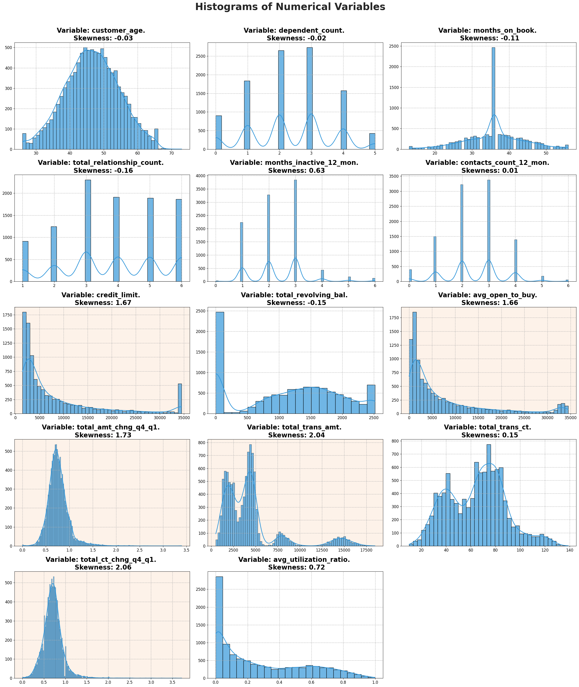
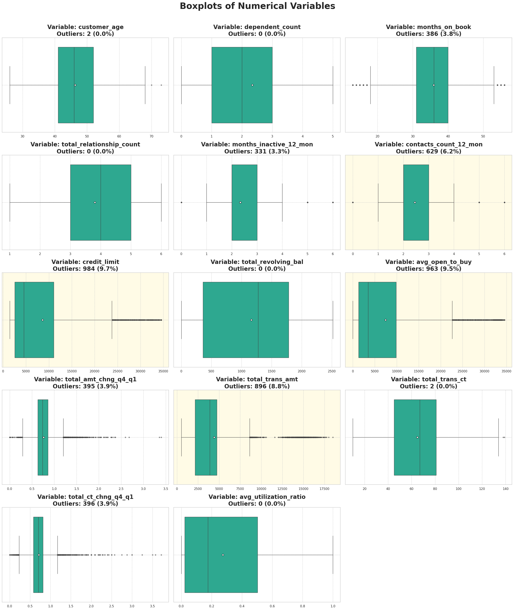
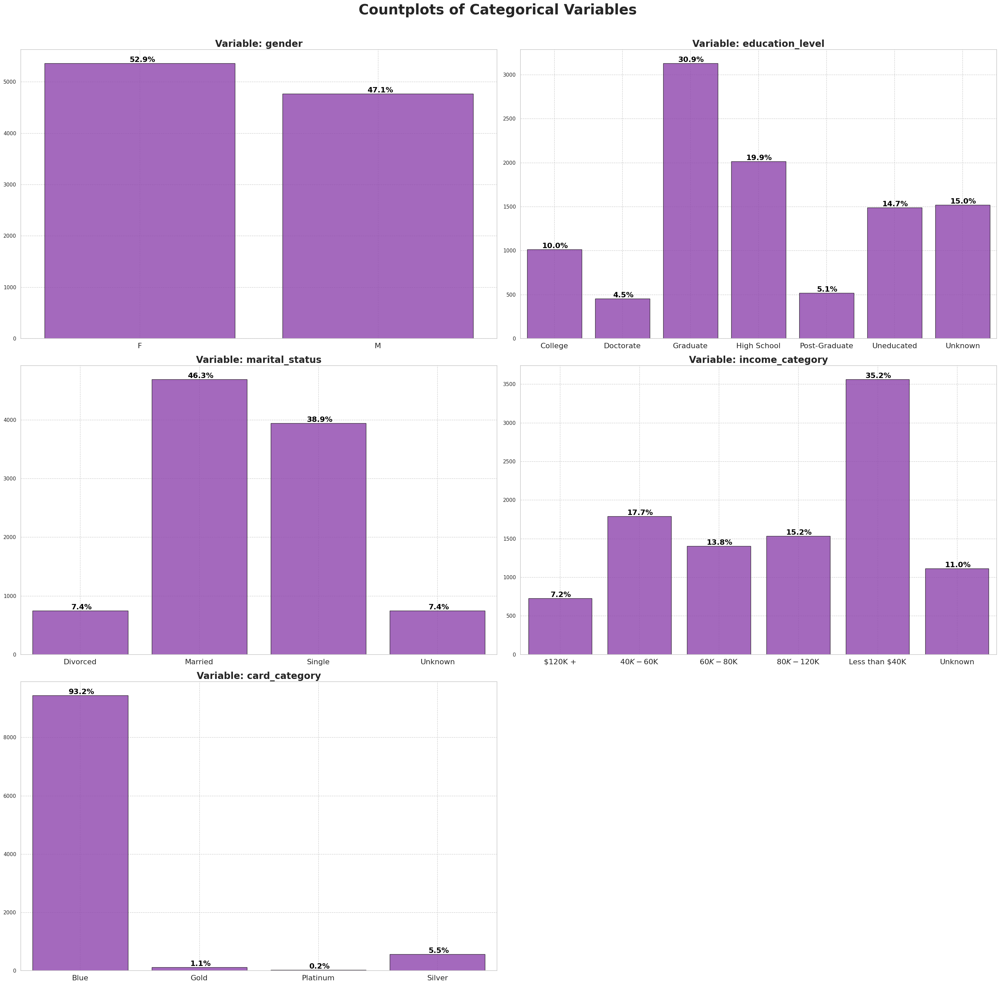
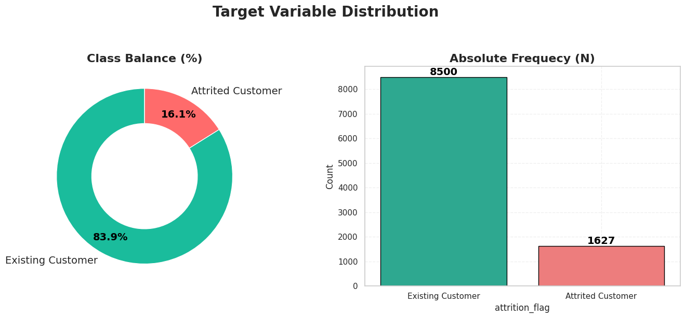
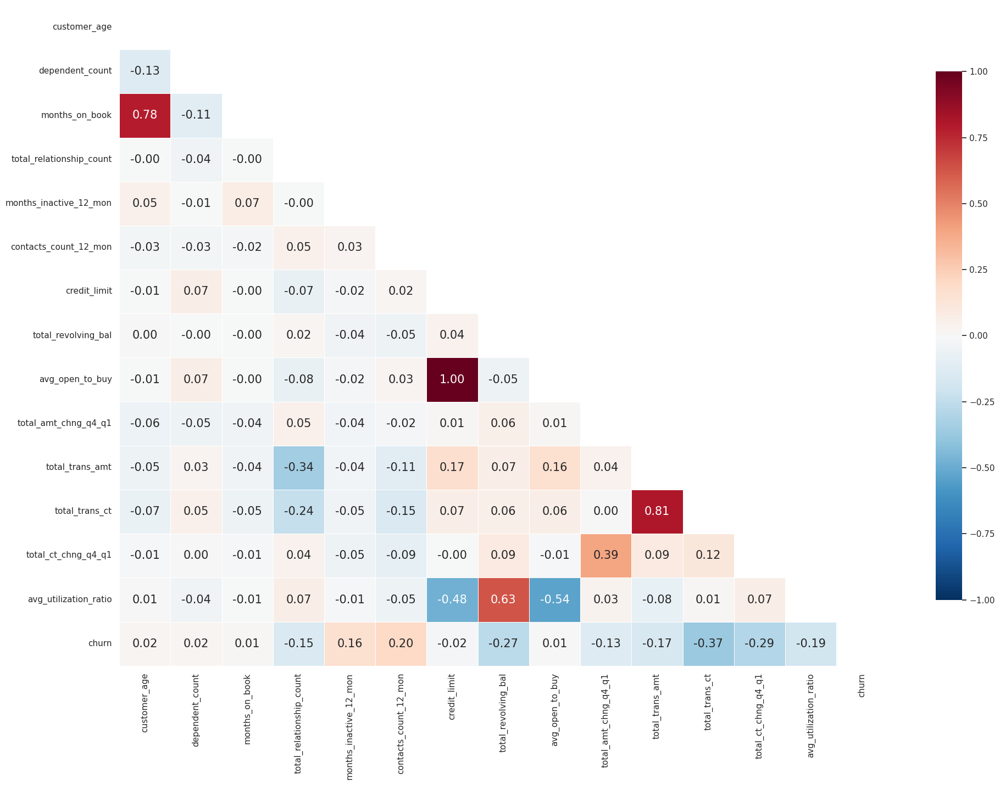
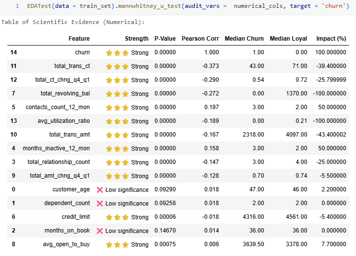
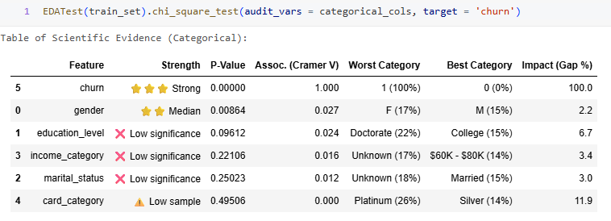
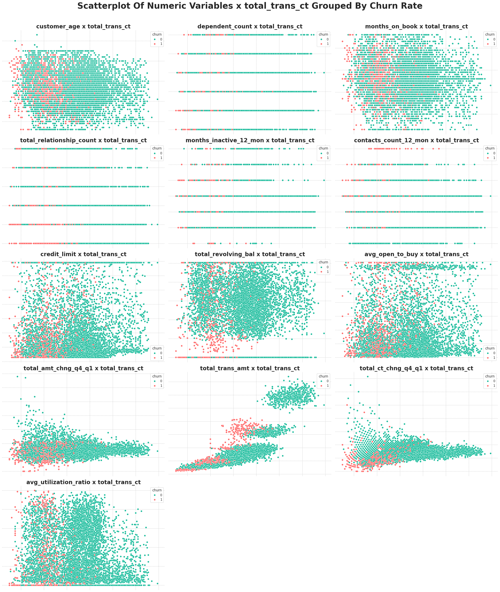

<a id="readme-top"></a>


[![Contributors][contributors-shield]][contributors-url]
[![Forks][forks-shield]][forks-url]
[![Stargazers][stars-shield]][stars-url]
[![Issues][issues-shield]][issues-url]
[![MIT License][license-shield]][license-url]
[![LinkedIn][linkedin-shield]][linkedin-url]

<br/>
<div align="center">
    
  
  <h1 align="center"> Churn Prediction </h1>

  <p align="center">
    <h3>Customer churn classification of a credit card service with LGBM - Classifier as the main classification model.</h3>
    <br/>
    <a href="https://github.com/OtnielGomes/Churn-Prediction-Credit-Card/tree/main/src"><strong>Explore the Docs and Functions »</strong></a>
    <br/><br/>
    <a href="https://github.com/OtnielGomes/Churn-Prediction-Credit-Card/tree/main/notebooks">View Notebooks</a>
    ·
    <a href="https://github.com/OtnielGomes/Churn-Prediction-Credit-Card/issues/new?labels=bug&template=bug-report---.md">Report Bug</a>
    ·
    <a href="https://github.com/OtnielGomes/Churn-Prediction-Credit-Card/issues/new?labels=enhancement&template=feature-request---.md">Request Feature</a>
  </p>
</div>


<!-- TABLE OF CONTENTS -->
<details>
  <br>
  <summary>Table of Contents</summary>
  <br/>
  <ol>
    <li>
      <a href="#about-the-project">About The Project</a>
      <ul>
        <li><a href="#built-with">Built With</a></li>
      </ul>
    </li>
    <li>
      <a href="#getting-started">Getting Started</a>
      <ul>
        <li><a href="#pre-requisites">Pre-requisites</a></li>
        <li><a href="#installation-of-libraries">Installation of libraries</a></li>
      </ul>
    </li>
    <li>
      <a href="#the-project">The Project</a></li>
      <ul>
        <li><a href="#1---business-understanding">1 - Business Understanding</a></li>
        <li><a href="#2---data-understanding">2 - Data Understanding</a></li>
        <li><a href="#3---data-preparation">3 - Data Preparation</a></li>
        <li><a href="#4---modeling">4 - Modeling</a></li>
        <li><a href="#5---evaluation">5 - Evaluation</a></li>
        <li><a href="#6---deployment">6 - Deployment</a></li>
      </ul>
    <li><a href="#roadmap">Roadmap</a></li>
    <li><a href="#contributing">Contributing</a></li>
    <li><a href="#license">License</a></li>
    <li><a href="#contact">Contact</a></li>
  </ol>
</details>

<br/>

<!-- ABOUT THE PROJECT -->
## About The Project

<br/>

## Project Description 
In this project, I will be working with a dataset provided by **Kaggle**, where I will develop a churn-rate analysis. The goal is to identify the causes and reasons for customer churn from a banking institution in relation to credit card services. After understanding these causes and reasons, some machine learning models will be developed to predict potential customers who will be abandoning the credit card service of this institution. With these predictions, I will seek to develop solutions to prevent or reverse the churn of these customers.  

---

### CRISP-DM Methodology
This project follows the CRISP-DM (*Cross-Industry Standard Process for Data Mining*) framework applied to **Customer Retention & Churn Prediction**:
| **Stage** | **Objective** | **Methodological Execution** |
| :--- | :--- | :--- |
| **1. Business Understanding** | Mitigate revenue loss by identifying at-risk customers. | • **Target Definition**: Binary Classification (Churn: Yes/No).<br>• **KPIs**: Maximize **Lift** in retention campaigns & Revenue Saved vs. Cost. |
| **2. Data Understanding** | Detect patterns of friction and dissatisfaction. | • **EDA**: Distribution analysis (Detect Imbalance).<br>• **Hypothesis Testing**: Correlation Matrix & Independence Tests (Chi-Square). |
| **3. Data Preparation** | Construct a robust dataset for parametric modeling. | • **Scaling**: Standardization (Z-score) for coefficient comparability.<br>• **Encoding**: One-Hot Encoding for nominal variables.<br>• **Splitting**: Stratified Train/Test Split to preserve class ratio. |
| **4. Modeling** | Estimate Churn Probability | • **Algorithms**: Logistic Regression, SVM LinearSVC, KNN, Random Florest, XGBoost, LightGBM.<br>• **Inference**: Analyze **Odds Ratios** to determine feature elasticity. |
| **5. Evaluation** | Assess model reliability and financial impact. | • **Discrimination**: AUC-ROC & F1-Score & Recall.<br>• **Calibration**: Probability Calibration Curve (Reliability Diagram). |
| **6. Deployment** | Integrate insights into the CRM lifecycle. | • **Deliverable**: "High-Risk" Customer List for Marketing Squad.<br>• **Artifact**: Serialize model (`joblib`) for batch inference. |

---

<p align="right">(<a href="#readme-top">back to top</a>)</p>


<br/>

## Built With
<br/>

- [![Databricks][Databricks Free]][Databricks Free-url]
- [![Language Python][Python]][Python-url]
- [![Apache][Apache Spark]][Apache Spark-url]
- [![PD][Pandas]][Pandas-url]
- [![NP][NumPy]][NumPy-url]
- [![Matplot][Matplotlib]][Matplotlib-url]
- [![Scipy][Scipy]][Scipy-url]
- [![Sklearn][scikit-learn]][scikit-learn-url]


<p align="right">(<a href="#readme-top">back to top</a>)</p>


## Getting Started

<br/>

**Clone the repository**
```sh
git clone https://github.com/OtnielGomes/Churn-Prediction-Credit-Card
```
<br/>

### Pre-requisites

> 📌 **This entire project was built using Databricks Free Edition**.

---

### 🧠 What is Databricks Free Edition?

**Databricks Free Edition** is the free version of the Databricks platform, designed for **students, educators, developers, and data enthusiasts**.  
It replaces the former *Community Edition* and offers a **serverless** environment with limited resources — ideal for **prototyping, learning, and collaboration**.

With it, you can:
- Create interactive notebooks (Python, SQL, Scala, R)
- Use **Databricks Assistant** for code suggestions and corrections
- Train machine learning models and build data pipelines
- Collaborate in real time with other users

---

### 📝 How to Sign Up

#### 1. Go to:  
[Databricks Free Edition – Microsoft Learn](https://learn.microsoft.com/en-us/azure/databricks/getting-started/free-edition)  
#### 2. Sign in with Google, GitHub, Microsoft, or another supported provider.  
#### 3. A **free workspace** will be automatically created for you.

---

### 🧭 First Steps in the Workspace

### 1. **Workspace**
- Organize your notebooks, scripts, and datasets
- Create folders and set sharing permissions

### 2. **Notebook**
- Interactive interface for writing and running code
- Supports **Python, SQL, R, Scala**

### 3. **Databricks Assistant**
- AI-powered helper that explains, suggests, and fixes code
- Works in notebooks and SQL editor


### Installation of Libraries

The installation of the required libraries is performed using the command:

```python
%pip install '..\requirements.txt'
```

This command is present in the first notebook of this project.

---

💡 **Note**:  
- In Jupyter/Databricks notebooks, the `%pip` magic command installs packages directly into the current environment.  
- If your `requirements.txt` file is located in a subdirectory or at a different path, make sure to update the path accordingly (e.g., `../requirements.txt`).

<p align="right">(<a href="#readme-top">back to top</a>)</p>


<br/>

## The Project

<br/>

## 1 - Business Understanding  
---

### Project Challenge


The bank manager identified growth in the number of customers who are abandoning the credit card service.

Given this scenario, the main objective of the project will be to transform historical data into **actionable intelligence**, making it possible to understand the factors associated with churn and anticipate customer attrition risk.

Stakeholders expect the proposed solution to be capable of:

1. **Analyzing historical data** to identify patterns and variables related to churn.
2. **Developing a machine learning model** to estimate the probability of customer attrition.
3. **Supporting strategic retention actions**, prioritizing customers with the highest cancellation propensity.

> From a business perspective, the project aims to reduce customer losses, improve the efficiency of retention campaigns, and support data-driven decisions in the context of active customer relationship management.

---

<p align="right">(<a href="#readme-top">back to top</a>)</p>

<br/>

## 2 - Data Understanding

---

### Dataset Overview
This dataset contains information from 10,000 bank customers, including demographic, financial, and relationship-related attributes such as age, salary, marital status, credit card limit, and card category.

> These variables provide the analytical foundation for investigating behavioral patterns associated with customer attrition and for supporting the construction of predictive models.

---

### Data File
- **Data file**: `BankChurners.csv`

---

### Target Variable
The dependent target variable is **`Attrition_Flag`**, a categorical feature with binary classes:

1. **`Existing Customer`**
- Represents customers who remained active, that is, non-churners.

2. **`Attrited Customer`**
- Represents customers who discontinued their relationship with the credit card service, that is, churners.

> Since this is a **binary classification** problem, the target variable will be used to distinguish customers who remain in the base from those who are more likely to leave.

---

### Data Source
- **Dataset collected from Kaggle**:

[https://www.kaggle.com/datasets/sakshigoyal7/credit-card-customers?sort=votes&select=BankChurners.csv](https://www.kaggle.com/datasets/sakshigoyal7/credit-card-customers?sort=votes&select=BankChurners.csv)

- **Original dataset reference**:

[https://leaps.analyttica.com/home](https://leaps.analyttica.com/home)

---
## Exploratory Data Analysis (EDA):
---

> The EDA will be conducted in three main stages: univariate, bivariate, and multivariate analysis.

### Univariate analysis

> **Evaluates one variable at a time, focusing on distribution, central tendency, dispersion, and outlier detection.**

---
### Bivariate analysis

> **Investigates the relationship between two variables, allowing the analysis of correlation, association, or differences between groups.**
---
### Multivariate analysis

> **Examines three or more variables simultaneously in order to identify more complex patterns, interactions, and joint behavior.**
---
<br/>

## Univariate Analysis:
---

<br/><br/>
<div align="center">
    
  </a>
</div>
<br/>

---

<br/><br/>
<div align="center">
    
  </a>
</div>
<br/>

<p align="right">(<a href="#readme-top">back to top</a>)</p>

<br/>

---

<br/><br/>
<div align="center">
    
  </a>
</div>
<br/>

---

<br/><br/>
<div align="center">
    
  </a>
</div>
<br/>

## Bi-Variate Analysis:
---
### Correlation of Variables x Churn

<br/><br/>
<div align="center">
    
  </a>
</div>
<br/>

<p align="right">(<a href="#readme-top">back to top</a>)</p>

<br/>

---
<br/><br/>
<div align="center">
    
  </a>
</div>
<br/>

---
<br/><br/>
<div align="center">
    
  </a>
</div>
<br/>

---
### Statistical Tests

---
<br/><br/>
<div align="center">
    
  </a>
</div>
<br/>

---
<br/><br/>
<div align="center">
    
  </a>
</div>
<br/>

### Multi-Variate Analysis:
---
<br/><br/>
<div align="center">
    
  </a>
</div>
<br/>


<p align="right">(<a href="#readme-top">back to top</a>)</p>

<br/>


### 3 - Data Preparation
---


- In this step, I will initially divide the training and testing data so that the testing data does not interfere in the analyses, so that the model does not have any bias from the testing data, and only with the training data is it capable of generating good classifications with good generalization.
---
- Next, an EDA will be conducted to verify the data and its main characteristics. In this EDA, the main objective will be to understand the relationship of the data with the churn rate of this banking institution.
---
### Exploratory Data Analysis - EDA

The **Exploratory Data Analysis (EDA)** for this project will be carried out in three main stages: **Univariate Analysis**, **Bivariate Analysis**, and **Multivariate Analysis**.  
The goal is to explore and understand the patterns within the dataset, identifying relationships, trends, and potential insights that can guide the development of effective solutions.

---

#### Univariate Analysis  
- **What it is:** Examines **one variable at a time**, without considering its relationship to others.  
- **Purpose:** Understand the distribution, central tendency, and dispersion of the variable, as well as detect possible outliers.  

---

#### Bivariate Analysis  
- **What it is:** Studies **the relationship between two variables**.  
- **Purpose:** Identify correlations, patterns, or dependencies, and assess how one variable may influence the other.  

---

#### Multivariate Analysis  
- **What it is:** Investigates **three or more variables simultaneously**.  
- **Purpose:** Understand complex interactions and multidimensional patterns, identifying combinations of factors that influence the observed behavior.  

---

### Univariate Analysis 

<br/><br/>
<div align="center">
    
  </a>
</div>
<br/>

- This dataset has imbalanced classes, which can be a factor to be considered when training machine learning models. Datasets with imbalanced classes make it more difficult to train and generalize model classifications, especially for **minority** classes. In general, models tend to learn more easily to predict the **majority class**, while they have more difficulty in detecting **minority classes**.
---

<br/><br/>
<div align="left">
    
  </a>
</div>
<br/>

#### Observations and insights regarding numerical data
---
- 1 - The **age of customers** is more widely distributed between the **40** and **50 age groups**, with **49** being the most frequent age group in these data.
---
- 2 - Most customers have between **2** and **3 dependents**, with a minority having 5 dependents.
---
- 3 - The length of the **customer's relationship** with the bank varies from **13** to **56 months**, with **36 months** being the most frequent.
---
- 4 - The **number of products** maintained by the customer is generally above **3 products**, with few customers maintaining only **1** or **2 products**.
---
- 5 - Most **customers remain inactive** for a maximum of **3 months**, with only a small fraction remaining inactive for **4** to **6 months**.
---
- 6 - The **number of contacts** in the last 12 months was, in most cases, **2** to **3 contacts**.
---
- 7 - The **number of transactions** is mostly distributed between **60** and **80 transactions**, with a very small portion of customers making less than **20** or more than **100 transactions**.
---
- 8 - Most customers have a **credit limit** of less than **5,000 dollars**, although there is a relatively significant portion of customers with a limit of **35,000 dollars**.
---
- 9 -Most customers have a **zero credit card revolving balance**, which is relatively positive, indicating that most customers are up to date with their bill payments.
---
- 10 - The **average open to buy**  is below **5,000 dollars**.
---
- 11 - Most credit **card limit utilization** is below **20%**, with a small portion of customers using more than **80%** of their credit card limit.
---

<br/><br/>
<div align="left">
    
  </a>
</div>
<br/>

#### Observations and insights regarding categorical data
---

- 1 - The majority of clients are women, with a percentage of **52.5%**.
---
- 2 - **46.1%** of clients are **married**, while **39.3%** are **single**. There is a small portion of **7.4%** of **divorced** clients and another portion of **7.2%** of clients who do **not fit** into any of the above categories.
---
- 3 - The majority of clients have a **Graduate** level of education, with **31%**. This status refers to people who have already graduated and completed a specialization in the area they studied.

  **High School** represents **20.1%**. This status refers to people who have already graduated and completed high school.

  **Unknown** represents **14.7%**. This status refers to people who possibly did not fill out the form or did not fit into any of the above classifications.

  **Uneducated** represents **14.6%**. This status refers to people who have not had access to formal education or have not completed a significant level of study.

  **College** represents **9.9%**. This status refers to higher education.

  Finally, the **Postgraduate** and **Doctorate** statuses have the smallest shares. **Postgraduate** is basically a synonym for **Graduate**, both referring to the same status, while **Doctorate** refers to the highest level of study.
---
- 4 - The majority of clients, **34.9%**, have an income below **40k**.

  **17.7%** of clients have an income between **40k and 60k**.

  **14%** have an income between **60k and 80k**.

  **15.3%** have an income between **80k and 120k**.

  **10.9%** did not fill out this information or do not fit into any of the categories above.

  A smaller portion, **7.3%**, has an income above **120k** per year.
---
- 5 - **93.1%** of customers have a **Blue** credit card, which is the dominant class. Next comes the **Silver** credit card with **5.6%**, and the **Gold** and **Platinum** cards with a small share of participation that is practically nil.
---

### Bivariate Analysis 

<br/><br/>
<div align="center">
    
  </a>
</div>
<br/>

---

<br/><br/>
<div align="center">
    
  </a>
</div>
<br/>

---

<br/><br/>
<div align="center">
    
  </a>
</div>
<br/>

---

<br/><br/>
<div align="center">
    
  </a>
</div>
<br/>

#### Observations and insights into the of numeric variables with the 'churn_target' variable.
---
- 1 - In the variable **total_revolving_bal**, it is possible to observe that a greater distribution of customers who stopped using their credit card is in the **lowest revolving balance values**. A significant portion of these customers have a revolving balance **below \$500**.
---
- 2 - In the variable **total_trans_amt**, it is possible to observe that customers who stopped using their credit card have a greater distribution in the **lower transfer values**. Most of these customers made a total of **transfers below \$2750**.
---
- 3 - In the variable **total_ct_chng_q4_q1**, it is possible to observe that most customers who kept their credit card service active had an increase of at least **50%** in the number of transactions carried out in relation to Q4 and Q1.
---
- 4 - In the **avg_utilization_ratio** variable, it is possible to observe that most customers who stopped using their credit card have practically **not used their credit card limit** in the last few months.
---
- 5 - In the **contacts_count_12_mon** variable, it is possible to observe that most customers who stopped using their credit card have a **number of contacts greater than or equal to 3**.
---
- 6 - In the **total_trans_ct** variable, it is possible to observe that most customers who stopped using the credit card have a number **below 80 transactions in the last 12 months**. And all customers who have **95 transactions or more** continued to use the credit card.
---
- 7 - The value of the revolving balances of customers who stopped using their credit cards is relatively lower, around **45% less**, than that of customers who continued using their credit cards.
---
- 8 - The total transfer values ​​in recent months are lower for customers who stopped using their credit cards.
---
- 9 - Customers who continued using their credit cards have a reasonably higher number of services.
---
- 10 - Customers who stopped using their credit cards have a higher number of inactive months and a higher number of contacts in the last 12 months.
---
- 11 - Customers who stopped using their credit cards had about **34% fewer transactions** compared to customers who continued using their credit card service in the last 12 months.
---

<br/><br/>
<div align="center">
    
  </a>
</div>
<br/>

---

<br/><br/>
<div align="center">
    
  </a>
</div>
<br/>

#### Observations and insights on categorical variables with the 'churn_target' variable
---
- 1 - The **level of education** does not demonstrate a very strong relationship with the rate of customers who stopped using credit card services. Considering that this variable is classified according to the levels of education, it was expected that the higher or lower the level of education, the more likely these customers would choose to continue using the credit card service.

- However, it is possible to draw some observations regarding this data, as it directly affects the institution's possible decision-making.
- The level of education with the highest churn rate is the **Doctorate**, with around **22.9%**. The lowest rates are the **Graduate** levels, with **15%**, and **High School**, with **15.1%** of churn rate.
---
- 2 - **Customers' annual income** does not have a significant influence on the rate of customers who stopped using their credit cards, as all salary ranges follow a practically similar distribution in relation to the churn rate index. Only customers with a salary range of **60k - 80k** had a churn rate of **13.3%**, which is slightly lower compared to the other salary ranges.
---
- 3 - The **credit card category** shows a significant relationship with the rate of customers who stopped using their credit cards. The **Gold** and **Platinum** categories had a higher-than-average rate of credit card service cancellations compared to the other categories. However, these two categories represent a very small percentage of this data set; together, they do not even have a **2%** share in relation to the other categories.
---
- 4 - The **Silver** category is the category with the lowest rate of credit card service cancellations **with a 14.1% churn rate**.
---
- 5 - Considering the data from this banking institution, it is possible to conclude that the rate of customers with the **Silver**, **Gold** and **Platinum** card brands is very low. We have **93%** of customers with the initial brand, which is the basic **Azul** card. It would be of great value for this institution to invest in a more flexible policy in its card categories. Offering more benefits to its customers and differentiated services through the **Silver**, **Gold** and **Platinum** brands can increase the loyalty rate of its customers.
---
- 6 - The **gender** of customers declared to have a specific relationship with the churn rate. Women reported having a higher rate of cancellation of the card service than men.
---
- 7 - The **relationship status** is graphically revealed to have a specific relationship with the churn rate indexes. **Married customers** have a **slightly lower** churn rate index than **single customers**.
---
- 8 - Initially considering the statistical data and graphs of these categorical variables, it is possible to conclude that they do not have a satisfactory relevance in solving the problem of this institution, which would be the turnover rate. However, we have some variables that somehow present some differences in their classes regarding the churn rate index, which directly affect these variables is the distorted distribution of these variables such as **marital_status and card_category**.

---

### Multivariate Analysis 

<br/><br/>
<div align="center">
    
  </a>
</div>
<br/>

#### Observations and insights into the of numeric variables x  total_trans_ct with the 'churn_target' variable.
---
- 1 - The variable **total_trans_ct** has a very strong correlation with the variable **churn_target**. Therefore, I chose to check its dispersion with the other variables, grouped by the target variable **churn_target**.

The combinations that best defined a good separation between **Non_churners** and **Churners** customers were:

- **total_trans_ct** x **total_trans_amt**
- **total_trans_ct** x **total_ct_chng_q4_q1**
- **total_trans_ct** x **total_ct_chng_q4_q1**

These variables refer to the quantity or total value of transactions, reinforcing the previous observations that the number of transactions and their total value reflect, in a certain way, the possible behavior of the customer, indicating whether he or she will continue to use the credit card or stop using it.

---
- 2 - The variables **total_revolving_bal** and **avg_utilization_ratio**, together with the variable **total_trans_ct**, had a reasonable separation of the **Churn** and **Non-churn** classes, although there was a greater dispersion in the graphs of these two variables.

---

<p align="right">(<a href="#readme-top">back to top</a>)</p>

<br/>

### 4 - Modeling
---  
In this stage, **I will test classical machine learning models** to evaluate their performance on the training data. The approach will be **intentionally simple** (without complex hyperparameter tuning or advanced preprocessing techniques), as algorithms like **Random Forest, Logistic Regression, and SVM** typically perform better with straightforward data transformations.  

---  

After this initial analysis, **I will prioritize the project’s main model**: a **neural network developed in PyTorch**. This architecture was chosen due to its:  

- **Ability to identify complex patterns** in non-linear data.  
- **Flexibility to adapt to class imbalances** (e.g., the observed 84%-16% class distribution).  
- **Generalization capability** (Highly efficient with unseen data).  

However, neural networks require **specific preprocessing**, particularly to address:  
1. **High-cardinality categorical variables** (e.g., unique identifiers).  
2. **Asymmetric distributions** (identified during the EDA phase).  
3. **Data noise** (such as outliers in numerical variables).  

To address these, I will apply:  
- **Embedding layers** for categorical variables.  
- **Cross-validation** to verify and adjust data across different partitions.  
- **Regularization techniques** (e.g., *dropout*) to prevent *overfitting*.  

---  

### Modeling Split into Two Phases 
#### **Phase 1: Classical Machine Learning Models**  
| **Objective** | **Tools** | **Metric** |  
|---------------|------------|-------------|  
| Establish a performance baseline for future comparison. | Scikit-learn (Decision Trees, SVM, Logistic Regression). | AUC-ROC. |  

#### **Phase 2: PyTorch Neural Network**  
| **Objective** | **Tools** | **Metric** |  
|---------------|------------|-------------|  
| Achieve better generalization on unseen data. | PyTorch, Torchmetrics, Ray Tune. | AUC-ROC, Recall. |  

---  

### Evaluation Metric Choice: AUC-ROC 
#### Why AUC-ROC?  
| **Criterion** | **Explanation** | **Business Impact** |  
|---------------|------------------|----------------------|  
| **Class imbalance** | Balances *recall* (capturing churning customers) and *specificity* (avoiding unnecessary actions on loyal customers). | Reduces operational costs by prioritizing high-risk customers. |  
| **Asymmetric cost sensitivity** | False negatives (missing churn) are more critical than false positives. | Improves retention campaign efficacy (e.g., personalized offers). |  
| **Universal interpretability** | Scores above **0.85** indicate strong predictive power for binary classification. | Simplifies communication with non-technical stakeholders. |  

---

### Training Classics Models - Cross-Validation

#### Data Preprocessing for Traditional ML Models  

Traditional ML algorithms benefit from features that share similar scales and distributions, ensuring stable convergence and fair weighting across predictors. For this, I adopted the following strategy:  

#### 1. Numerical Variables  

| **Technique**       | **Applied Variables**                                                                                                                                                                                                                             | **Justification**                                                                                     |
|---------------------|---------------------------------------------------------------------------------------------------------------------------------------------------------------------------------------------------------------------------------------------------|-------------------------------------------------------------------------------------------------------|
| **StandardScaler**  | All numeric features (`credit_limit`, `total_amt_chng_q4_q1`, `total_ct_chng_q4_q1`, `avg_utilization_ratio`, `customer_age`, `dependent_count`, `months_on_book`, `total_relationship_count`, `months_inactive_12_mon`, `contacts_count_12_mon`, `total_revolving_bal`, `total_trans_amt`, `total_trans_ct`) | Removes the mean and scales to unit variance, aligning feature ranges and mitigating outlier influence. |

#### 2. Categorical Variables  

| **Technique**      | **Applied Variables**                                                    | **Justification**                                                                                   |
|--------------------|----------------------------------------------------------------------------|-----------------------------------------------------------------------------------------------------|
| **OrdinalEncoder** | Ordinal features (`education_level`, `income_category`, `card_category`)   | Preserves inherent ordering without inflating dimensionality.                                       |
| **OneHotEncoder**  | Nominal features (`gender`, `marital_status`)                             | Encodes each category distinctly, avoiding implied ranking and maintaining model interpretability. |
---

### Applying Cross Validation

<br/>
<div align="center">
    
  </a>
</div>
<br/>

---
### Training Neural NetWorks Models With PyTorch - Cross Validation

#### Data Preprocessing for Neural Network Models  

Neural networks benefit from feature scaling and encoding strategies that normalize value ranges and preserve meaningful relationships between categories, contributing to stable and efficient training. Based on this, I adopted the following preprocessing strategy:  

---

#### 1. Numerical Variables  

| **Technique**    | **Applied Variables**                                                                                                                                                                                        | **Justification**                                                                                                                |
|------------------|----------------------------------------------------------------------------------------------------------------------------------------------------------------------------------------------------------------|----------------------------------------------------------------------------------------------------------------------------------|
| **MinMaxScaler** | `months_on_book`, `customer_age`, `dependent_count`, `total_relationship_count`, `months_inactive_12_mon`, `contacts_count_12_mon`, `total_revolving_bal`, `avg_utilization_ratio`, `total_amt_chng_q4_q1`, `total_ct_chng_q4_q1`, `total_trans_ct` | Scales features to the [0, 1] range, preserving the original distribution shape and ensuring that all features contribute uniformly. |
| **RobustScaler** | `credit_limit`, `total_trans_amt`                                                                                                                                                                             | Reduces the influence of outliers and large value ranges, improving robustness in the presence of extreme values.               |

---

#### 2. Categorical Variables  

| **Technique**                  | **Applied Variables**                              | **Justification**                                                                                                                                                                |
|--------------------------------|----------------------------------------------------|----------------------------------------------------------------------------------------------------------------------------------------------------------------------------------|
| **OrdinalEncoder**             | `gender`, `marital_status`                         | Encodes nominal categories as integers for direct embedding or subsequent processing, without implying any intrinsic order.                                                     |
| **Custom OrdinalEncoder + Embedding Layer** | `education_level`, `income_category`, `card_category` | Preserves the natural order between categories (e.g., `High School` → `College` → `Graduate School`) for ordinal features and maps them to dense vectors through embeddings, allowing the network to learn richer relationships. |

---

**Note on Embeddings in PyTorch**  

Embedding layers are applied to **ordinal and nominal features** because they offer several key benefits:  


- **Richer semantic representation**   

  Transform categories into dense, continuous vectors that allow the network to capture both explicit and hidden relationships—hierarchies and inclusive similarities—that are impossible to express with fixed encodings like one-hot. 

- **Dimensionality reduction for high-cardinality features**

  Drastically reduce the size of the input space compared to one-hot encoding, which is particularly valuable for variables with many unique categories.  

- **Learnable, task-specific mappings**   

  Embedding vectors are optimized together with the rest of the network’s parameters, meaning that the representation adapts to the specific prediction task, improving accuracy and generalization.  

- **Performance and scalability**   

  Lower memory usage and computational load by avoiding sparse, high-dimensional matrices — enabling faster training and inference without sacrificing representational power.  

---

### Applying Cross Validation

<br/>
<div align="left">
    
    
</div>

<br/>
<div align="left">
    
    
</div>

<br/>
<div align="left">
    
    
</div>

<br/>
<div align="left">
    
    
</div>

<br/>
<div align="left">
    
    
</div>

<br/>                                                                        

✅ Cross validation Metrics:

---
🔴 Loss: 0.027 - ☑️ Standard Deviation - Loss: 0.002934

---

🟠 Accuracy: 96.17% - ☑️ Standard Deviation - Accuracy: 0.005298

---

🔵 Precision: 84.58% - ☑️ Standard Deviation - Precision: 0.026960

---

🔵 NPV: 98.69% - ☑️ Standard Deviation - NPV: 0.002221

---

⚠️ Recall: 93.27% - ☑️ Standard Deviation - Recall: 0.012720

---

🎯 AUC-ROC: 99.10% - ☑️ Standard Deviation - AUC-ROC: 0.001672

---

<br/>

### Scores of Models

<br/> 
<div align="left">
    
</div>

<p align="right">(<a href="#readme-top">back to top</a>)</p>

---

<br/>

### 5 - Evaluation

At this stage, I analyze the comparative performance of **classical machine learning models** and the **PyTorch neural model**, focusing on both technical and business criteria.  
The comparison considers the top 3 models based on their performance during **cross-validation**.

---

### What is the main goal of a churn prediction project?

- **Customer retention**: prevent customer loss and extend their journey with the institution.
- **Cost reduction**: optimize retention campaigns.
- To achieve this, two indicators are essential: **CAC** and **LTV**.

---

### What are these indicators and how can they financially impact a banking institution?

**Customer Acquisition Cost (CAC)** — varies according to business model, channel, and customer profile.

**Average ranges observed in the market in recent years**:
- **Digital banks/fintechs**: From **US\$ 200** to **US\$ 700** per customer (optimized digital channels and segmented campaigns).
- **Traditional banks**: Above **US\$ 1,000** per customer (dependence on physical branches and mass media).
- **Aggressive campaigns**: From **US\$ 1,500** to **US\$ 2,500+**, especially for high-income or corporate customers.

**What makes up the CAC**:
- Advertising (TV, radio, print, digital media)
- Performance marketing (Google Ads, social media, affiliates)
- Sales salaries and commissions
- Events and sponsorships
- Financial incentives (cashback, bonuses, fee waivers)
- CRM and marketing automation tools/systems

**Strategy and return**:
- CAC is evaluated alongside **Lifetime Value (LTV)**.
- Customers using multiple products (account, credit card, investments, insurance) justify higher CACs as returns are spread over several years.

**Source of estimated values**:  
[Forbes – What Are Banks’ And Fintechs’ Real Customer Acquisition Costs?](https://www.forbes.com/sites/ronshevlin/2025/03/23/what-are-banks-and-fintechs-real-customer-acquisition-costs/)

---

### Model Performance

| **Model**               | **AUC-ROC** | **Std. Dev. (AUC-ROC)** | **Highlight** |
|-------------------------|-------------|--------------------------|---------------|
| Random Forest           | 98.26%      | ±0.001795                 | Good generalization and consistent AUC-ROC. |
| Gradient Boosting       | 99.18%      | ±0.001530                 | Highest AUC-ROC. |
| Neural Network (PyTorch)| 99.10%      | ±0.001672             | Excellent performance and good generalization. |

---

### Why prioritize the PyTorch model?

1. **Robust generalization**:
   - Lowest standard deviation, indicating superior consistency.
   - Dropout (`p=0.2`) and L2 regularization to mitigate overfitting.

2. **Adaptability to new data**:
   - More efficient architecture for unseen data and atypical patterns.
   - Ability to learn complex non-linear relationships.

3. **Business costs**:
   - **False negatives** cost 5 to 7 times more than false positives.  
     estimate: **US\$ 2,500** per lost customer vs. **US\$ 500** per unnecessary offer 
   - Architectural adjustments and loss functions (e.g., Focal Loss) prioritize **recall**.

---

### Hyperparameter Tuning

- The network architecture and its parameters/hyperparameters are already well-defined, and the current metrics are satisfactory for the project’s objectives.  
Therefore, the **hyperparameter tuning** process will be used to validate the parameters already tested and implemented, as well as to seek an **improvement in the AUC-ROC score**, focusing on **reducing variance** and **bias** across the models in the 5-fold cross-validation.

- Given the complexity of neural networks, it is challenging to precisely determine the ideal number of neurons per layer.  
Architectures with a progressive decrease in neurons — such as **256 → 128 → 64** — are often effective in many scenarios.  
However, it is still important to explore new possibilities and test different configurations in this regard.

- A more precise adjustment of the **learning rate** will also be performed, along with verification of the **L2 regularization (weight decay)**.  
The goal is to assess whether a lower value (`1e-5`) remains more effective than a higher value (`5e-4`) in the current context.

- Finally, the impact of **batch size** will be tested, with values of **128, 256, and 512**.  
The choice of larger batch sizes is justified by the use of **Batch Normalization** in the network layers.  
Using very small batches can negatively affect performance, since BatchNorm calculates the mean and variance of the input data in each mini-batch for normalization.  
With very small batches, these statistics may become unstable, which can harm the network’s performance.

---

### Final Training

- In this step, the parameters and hyperparameters obtained during the hypertuning process will be applied to a training and validation workflow, using **80%** of the data for training and **20%** reserved for validation.

- After training, the model will be saved and applied to the **test data** to verify its **actual performance** and confirm that its bias and variance are consistent and within expectations in relation to the training data.

<br/>
<div align="left">
    
    
</div>

---
## Final Testing

### Analyzing model performance on test data

<br/>
<div align="center">
    
</div>

<br/><br/>
<div align="left">
    
</div>

<br/><br/>
<div align="center">
    
</div>

---

### Financial Results

#### Final Metrics – Test Data

After applying the trained model to the test dataset, the following performance metrics were obtained. These results confirm the model’s ability to generalize well and maintain consistency on unseen data:

| **Metric**    | **Score** |
|---------------|-----------|
| **Loss**      | 0.027     |
| **Accuracy**  | 96.6%     |
| **Precision** | 85.7%     |
| **NPV**       | 99.0%     |
| **Recall**    | 94.8%     |
| **AUC-ROC**   | 99.2%     |

- The **low loss value** indicates strong convergence and minimal prediction error.  
- The **high recall** confirms the model’s effectiveness in identifying churn cases, aligning with the strategic goal of minimizing customer loss. The model captures **94.8%** of churners, enabling retention actions before potential service discontinuation.  
- The **NPV and precision** values demonstrate balanced performance across both classes.  
- The **AUC-ROC of 99.2%** reinforces the model’s high discriminative power and reliability in probabilistic churn prediction.

These metrics validate the robustness of the trained model and its suitability for deployment in retention strategies. The high AUC-ROC allows for more assertive campaigns targeting customers classified as churners. Considering the previously mentioned **Customer Acquisition Cost (CAC)** and **Lifetime Value (LTV)**, we can build a hypothetical scenario (as no official figures are available for this institution) to estimate the costs involved in retention and the potential loss of customers.

---

**Hypothetical Cost Scenario:**

- **Cost to acquire a customer:** US\$ 2,500  
- **Cost to retain a customer classified as a churner:** US$ 500  

Based on the confusion matrix:  
- **329 churners**  
- **1,672 non-churners**  
- The model classified **364 customers as churners**

#### 1. Cost of false positives (non-churners classified as churners):

- With a precision of **85.7%**, there were **52 false positives**.  
- Cost: 52 × US\$ 500 = **US\$ 26,000**  
- Total retention campaign cost: 364 × US\$ 500 = **US\$ 182,000**  
- Proportion of resources incorrectly allocated:  
  US\$ 26,000 / US\$ 182,000 = **14.28%**

This is considered satisfactory, as only a small portion of resources would be spent on customers who would not have left the service. Nevertheless, such actions may still positively impact customer loyalty.

#### 2. Preservation of customer acquisition investment (CAC):

- Total investment to acquire the 329 churners: 329 × US\$ 2,500 = **US\$ 822,500**  
- With a recall of **94.8%**, the model correctly identifies **312 churners**  
- Preserved value: 312 × US\$ 2,500 = **US\$ 780,000**

Therefore, the model has the potential to preserve up to **US\$ 780,000** in acquisition investment, provided that retention actions are effective.  
The high AUC-ROC reinforces confidence in making more aggressive decisions with low risk of wasting resources on customers not at risk of churn.

---

#### 3. Lifetime Value (LTV) Assessment

**Lifetime Value (LTV)** is a strategic metric that estimates the total value a customer generates for the institution over the course of their relationship.  
It helps assess whether investments in **acquisition (CAC)** and **retention** are financially justified.

The simplified formula for calculating LTV is:

**LTV = Average Ticket × Purchase Frequency × Average Relationship Duration**

For illustrative purposes, let’s consider the following estimated values based on credit card customers:

- **Average monthly ticket:** US\$ 150 *(estimated value, as no official data is available)*  
- **Purchase frequency:** monthly  
- **Average relationship duration:** 3 years (36 months), based on the bank’s customer history  

**Estimated LTV = 150 × 12 × 3 = US\$ 5,400**

This value represents the average return the bank can expect from each customer over three years.  
Comparing it to the **average CAC of US\$ 2,500**, we have an **LTV/CAC ratio of 2.16**, indicating a healthy and sustainable relationship — meaning the value generated per customer is more than double the acquisition cost.

This analysis reinforces the importance of effective retention strategies:  
- By preserving churners, the model not only avoids losing the acquisition investment but also **protects the customer’s future LTV**.

#### Potential Revenue Preserved:

- **Potential gross revenue** over a 3-year period for customers identified as churners and successfully retained:  
  312 × US\$ 5,400 = **US\$ 1,684,800**

- Additionally, with a recall of **94.8%**, the model has the potential to preserve up to **US\$ 780,000** in acquisition investment (CAC) and **US\$ 1.68 million** in future gross revenue (LTV), provided that retention actions are effective.

---

**Conclusion:**  
A predictive model with high AUC-ROC and recall not only reduces immediate losses but also **maximizes the long-term value** of customers, directly contributing to the institution’s profitability and sustainability.

---

<p align="right">(<a href="#readme-top">back to top</a>)</p>

<br/>

### 6 - Deployment  

In this step, I deploy the final churn prediction classifier, developed using the insights and statistical patterns identified during the Exploratory Data Analysis (EDA).  
The model processes individual customer data and returns:  

- **Churn probability** — the likelihood of the customer leaving.  
- **Key influencing factors** — the main behavioral and financial indicators driving the prediction.  
- **Actionable recommendations** — targeted suggestions to help reduce churn risk.  

This deployment enables data-driven decision-making, allowing the business to proactively implement retention strategies, improve customer engagement, and maximize lifetime value.

<br/>
<div align="center">
    
</div>

<br/>
<div align="center">
    
</div>

---

<p align="right">(<a href="#readme-top">back to top</a>)</p>

<!-- ROADMAP -->
<br/>

## Roadmap

- [Notebook-1-EDA](https://github.com/OtnielGomes/1_Portfolio-Credit-Card_Churn_Analysis_with_Pytorch/notebooks/0_EDA.ipynb)
- [Notebook-2-Modeling](https://github.com/OtnielGomes/1_Portfolio-Credit-Card_Churn_Analysis_with_Pytorch/notebooks/1_Modeling.ipynb)


See the [open issues](https://github.com/OtnielGomes/1_Portfolio-Credit-Card_Churn_Analysis_with_Pytorch/issues) for a full list of proposed features (and known issues).

<p align="right">(<a href="#readme-top">back to top</a>)</p>

<!-- CONTRIBUTING -->
<br/>

## Contributing

Contributions are what make the open source community such an amazing place to learn, inspire, and create. Any contributions you make are **greatly appreciated**.

If you have a suggestion that would make this better, please fork the repo and create a pull request. You can also simply open an issue with the tag "enhancement".

<p align="right">(<a href="#readme-top">back to top</a>)</p>

### Top contributors:

<br/>
<a href="https://github.com/OtnielGomes/1_Portfolio-Credit-Card_Churn_Analysis_with_Pytorch/graphs/contributors">
  
</a>


<!-- LICENSE -->
<br/>

## License

Distributed under the MIT License. See [`LICENSE.txt`](https://github.com/OtnielGomes/1_Portfolio-Credit-Card_Churn_Analysis_with_Pytorch/blob/main/LICENSE) for more information.

<p align="right">(<a href="#readme-top">back to top</a>)</p>


<!-- CONTACT -->

<br/>

## Contact

[![LinkedIn][linkedin-shield]][linkedin-url]

<p align="right">(<a href="#readme-top">back to top</a>)</p>


<!-- MARKDOWN LINKS & IMAGES -->

[contributors-shield]: https://img.shields.io/github/contributors/OtnielGomes/Churn-Prediction-Credit-Card.svg?style=for-the-badge
[contributors-url]: https://github.com/OtnielGomes/Churn-Prediction-Credit-Card/graphs/contributors

[forks-shield]: https://img.shields.io/github/forks/OtnielGomes/Churn-Prediction-Credit-Card.svg?style=for-the-badge
[forks-url]: https://github.com/OtnielGomes/Churn-Prediction-Credit-Card/network/members

[stars-shield]: https://img.shields.io/github/stars/OtnielGomes/Churn-Prediction-Credit-Card.svg?style=for-the-badge
[stars-url]: https://github.com/OtnielGomes/Churn-Prediction-Credit-Card/stargazers

[issues-shield]: https://img.shields.io/github/issues/OtnielGomes/Churn-Prediction-Credit-Card.svg?style=for-the-badge
[issues-url]: https://github.com/OtnielGomes/Churn-Prediction-Credit-Card/issues

[license-shield]: https://img.shields.io/github/license/OtnielGomes/Churn-Prediction-Credit-Card.svg?style=for-the-badge
[license-url]: https://github.com/OtnielGomes/Churn-Prediction-Credit-Card/blob/main/LICENSE

[linkedin-shield]: https://img.shields.io/badge/-LinkedIn-black.svg?style=for-the-badge&logo=linkedin&colorB=555
[linkedin-url]: https://linkedin.com/in/otnielgomes

[Azure Databricks]: https://img.shields.io/badge/Databricks-FF3621?style=for-the-badge&logo=Databricks&logoColor=white
[Azure Databricks-url]:  https://azure.microsoft.com/en-us/pricing/purchase-options/azure-account?icid=databricks


[scikit-learn]: https://img.shields.io/badge/scikit--learn-%23F7931E.svg?style=for-the-badge&logo=scikit-learn&logoColor=white
[scikit-learn-url]: https://scikit-learn.org/stable/

[Apache Spark]: https://img.shields.io/badge/Apache%20Spark-FDEE21?style=flat-square&logo=apachespark&logoColor=black
[Apache Spark-url]: https://spark.apache.org/

[Pandas]: https://img.shields.io/badge/pandas-%23150458.svg?style=for-the-badge&logo=pandas&logoColor=white
[Pandas-url]: https://pandas.pydata.org/

[Matplotlib]: https://img.shields.io/badge/Matplotlib-%23ffffff.svg?style=for-the-badge&logo=Matplotlib&logoColor=black
[Matplotlib-url]: https://matplotlib.org/

[Scipy]: https://img.shields.io/badge/SciPy-%230C55A5.svg?style=for-the-badge&logo=scipy&logoColor=%white
[Scipy-url]: https://scipy.org/

[NumPy]: https://img.shields.io/badge/numpy-%23013243.svg?style=for-the-badge&logo=numpy&logoColor=white
[NumPy-url]: https://numpy.org/

[Python]: https://img.shields.io/badge/python-3670A0?style=for-the-badge&logo=python&logoColor=ffdd54
[Python-url]: https://www.python.org/

[Databricks Free]: https://img.shields.io/badge/Databricks-FF3621?style=for-the-badge&logo=Databricks&logoColor=white
[Databricks Free-url]: https://www.databricks.com/br/learn/free-edition
